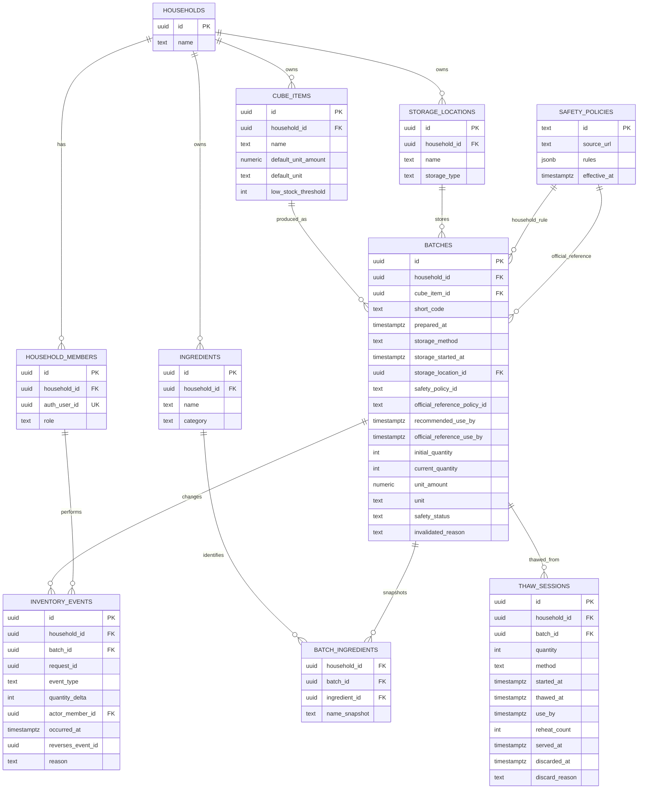
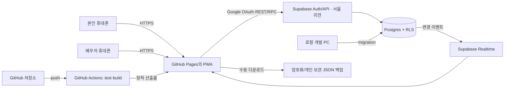

# 이유식 큐브 관리 사이트 조사 및 제작 계획

> 문서 상태: 초기 조사 참고자료 — 현재 구현 범위가 아님  
> 현재 기준안: [간단 MVP 계획](mvp-plan.md)  
> 조사 기준일: 2026-08-24  
> 대상 사용자: 본인과 배우자 2명  
> 운영 목적: 비상업적 가정용 기록·재고 관리

## 1. 결론

이 프로젝트는 범용 육아 앱이나 식단 추천 서비스가 아니라 **두 사람이 함께 쓰는 이유식 큐브 재고 원장**으로 시작하는 것이 가장 적합하다.

추천 구조는 다음과 같다.

- 화면: React + TypeScript + Vite 기반의 모바일 우선 PWA
- 공유 데이터: Supabase Postgres
- 로그인: 본인과 배우자의 Google 계정만 허용하는 Supabase Auth
- 권한: 모든 테이블에 가구 단위 Row Level Security(RLS)
- 동기화: 저장 직후 서버 재조회 + Supabase Realtime
- 소스 관리: GitHub
- 사이트 배포: GitHub Actions로 빌드한 정적 파일을 GitHub Pages에 배포
- 핵심 재고 단위: 재료 합계가 아니라 **제작 배치(batch/lot)**
- 가정 운영 보관 정책: 조리 시각 기준 냉장 24시간, 냉동 14일. 질병관리청의 냉동 7일 권고는 별도 공식 참고기한으로 함께 계산·표시
- 사이트 문구: 자가제조 큐브에는 상업 제품의 법정 기한처럼 보이는 `유통기한` 대신 `권장섭취기한(가정 관리 기준)` 사용
- 초기 예상 운영비: 공개 GitHub 저장소의 Pages와 Supabase Free 범위 안에서는 월 0원으로 시작 가능. 단, 자동 백업·저활동 일시정지·비공개 코드 요구가 생기면 유료 전환을 검토

가장 중요한 성공 기준은 다음 한 문장이다.

> 한 배치를 한 번 등록하고, 큐브를 꺼낼 때 1~2번 탭하면 배우자 화면에도 바로 반영되며, 일주일 뒤 실제 냉동실 수량과 앱 수량의 차이가 없어야 한다.

## 2. 목표와 비목표

### 목표

1. 어떤 큐브가 몇 개 남았는지 냉동실을 열지 않고 확인한다.
2. 먼저 꺼내야 할 제작분을 권장섭취기한 순으로 찾는다.
3. 본인과 배우자가 각자 휴대폰에서 같은 재고를 보고 수정한다.
4. 누가 언제 제작·꺼냄·먹임·폐기·수정했는지 감사 가능한 이력을 남긴다.
5. 최신 국내 영유아 보관 권고를 기본값으로 적용하되 출처와 계산 근거를 표시한다.
6. 사이트 설치, 백업, 배포, 계정 복구까지 가족이 직접 운영할 수 있게 한다.

### 초기 비목표

- 공개 회원가입, 다가구 판매, 구독, 광고
- 의료 진단, 알레르기 확진, 영양 처방
- 일반 냉장고·식료품·생활용품 재고 관리
- AI 식단·레시피 추천
- 사진 인식, 바코드/OCR, QR 스캔
- 성장곡선, 수유·수면·배변까지 포함한 종합 육아일지

이 기능들은 핵심 재고 흐름이 실제 생활에서 안정된 다음에만 검토한다.

## 3. 조사에서 확인한 패턴

### 국내 이유식·육아 앱

| 사례 | 확인한 패턴 | 적용할 점 | 보류할 점 |
|---|---|---|---|
| [이유식 플래너](https://apps.apple.com/kr/app/%EC%9D%B4%EC%9C%A0%EC%8B%9D-%ED%94%8C%EB%9E%98%EB%84%88/id6757943378) | 큐브 재고, 식단, 가족 공유, 부족 수량 표시 | 계획과 실제 사용을 분리하고 사용자 정의 재료를 허용 | 식단 전체를 첫 버전에 포함하지 않음 |
| [WeanDaily](https://apps.apple.com/kr/app/weandaily-%EC%9D%B4%EC%9C%A0%EC%8B%9D-%EA%B8%B0%EB%A1%9D-%EC%95%B1/id6792019720) | 식사 완료와 재고 자동 차감 연결 | 차감·삭제·알림 취소를 한 트랜잭션으로 처리 | 통계는 실제 데이터가 쌓인 뒤 추가 |
| [맘마노트](https://mammanote.com/) | 제조일, 개수, 용량, 기한, 알레르기, 오프라인 우선 | 임박순 정렬, 완료 취소 시 정확한 배치 복원 | 고정 용량 대신 자유 입력과 프리셋 병행 |
| [냠냠일기](https://apps.apple.com/kr/app/%EB%83%A0%EB%83%A0%EC%9D%BC%EA%B8%B0-%EC%95%84%EA%B8%B0-%EC%9D%B4%EC%9C%A0%EC%8B%9D-%EA%B8%B0%EB%A1%9D/id1256896728) | 검색, 달력, 내보내기, 반복 기록 재사용 | 최근 입력 복사와 파일 내보내기 | 복잡한 달력은 2단계로 이동 |
| [베이비타임](https://apps.apple.com/kr/app/%EB%B2%A0%EC%9D%B4%EB%B9%84%ED%83%80%EC%9E%84-babytime-%EC%88%98%EC%9C%A0-%EC%9C%A1%EC%95%84-%EC%9D%BC%EA%B8%B0/id1052459780) | 한 손으로 최소 터치 기록, 공동양육자 타임라인 | 시간 기본값은 항상 `지금`, 저장 버튼은 한 번 | 큐브와 무관한 육아 기록은 제외 |

전문 이유식 앱 상당수는 신규이거나 공개 평가 수가 작다. 따라서 이 표는 시장 검증의 증거가 아니라 입력·공유·재고 UX 패턴의 참고 자료로만 사용한다. 특히 리뷰에서 반복된 긴 폼, 고정 용량, 복사 부족, 가족 동기화 오류를 P0 설계의 회피 조건으로 삼는다.

### 해외·인접 재고 앱

| 사례 | 확인한 패턴 | 적용할 점 |
|---|---|---|
| [Mash](https://apps.apple.com/au/app/baby-food-tracker-mash/id6765965022) | 재료·조리법·질감·개수·큐브 크기·냉동일을 배치로 기록 | 배치 등록 폼, 부족/임박 상태, 해동 시 차감 |
| [Babeat](https://apps.apple.com/ph/app/babeat-baby-meal-planner/id6759101056) | 미래 식단이 요구하는 큐브 수 예측, 이전 식사 복사 | 2단계에서 계획 수량과 실제 차감을 분리 |
| [Deepchill](https://deepchill.eu/) | 짧은 물리 라벨 코드, 임박순, 여러 보관 위치, 가구 공유 | 성에가 끼어도 읽을 수 있는 짧은 배치 코드 |
| [PumpStash](https://pumpstash.app/) | 2탭 기록, 가장 오래된 팩 우선, 남은 일수 요약 | 총 개수와 함께 현재 사용량 기준 `며칠분` 표시 |
| [What The Fridge?!](https://www.what-the-fridge.app/) | 위치·태그·공유·임박 알림 | 가구 공유와 알림 설정을 사용자별로 분리 |
| [Grocy](https://grocy.info/) | 자체 호스팅 PWA, 재고·기한·레시피 차감, 기능 플래그 | 기능을 단계별로 켜는 구조만 차용하고 복잡성은 제외 |

### 인쇄물·수기 자료

| 자료 | 확인한 패턴 | 사이트 적용 |
|---|---|---|
| [A4 냉동고 재고표](https://www.thermomixdivarecipes.com/wp-content/uploads/2020/03/Freezer-Inventory-Free-Printable.pdf) | 음식, 기한, 수량과 체크박스만 남긴 단순함 | 인쇄 보기에서도 핵심 4~5개 필드만 표시 |
| [냉동고 재고표 활용 사례](https://www.realmomnutrition.com/freezer-inventory-printable/) | 냉동고 옆에 붙이고 수량을 즉시 고침 | 로그인 장애 시 참고할 한 페이지 현황 출력 |
| [Freezer Labels + Inventory Pack](https://our-family-cooks.com/product/meal-prep-freezer-labels/) | 음식명·날짜·해동/조리 지시를 라벨과 전체 목록에 연결 | 배치 등록 직후 라벨/A4 인쇄 |
| [이유식 주간 기록지 사례](https://yunyun-zip.tistory.com/8) | 월간 개요와 주간 상세를 분리 | 식단 기능 추가 시 개요/상세 화면 분리 |

인쇄물은 냉동고 앞에서 즉시 보인다는 장점이 있지만 동기화, 자동 차감, 알림, 수정 이력이 없다. 따라서 수기로 별도 원장을 유지하기보다 **앱 데이터를 원본으로 하고 그 시점의 재고표와 라벨을 출력**해야 한다.

### 실제 사용 연구에서 얻은 경고

[LOWINFOOD 가정용 재고 앱 실증 보고서](https://lowinfood.eu/wp-content/uploads/2025/10/D5.10.pdf)는 표본이 작아 효과 수치를 일반화할 수 없지만 다음 UX 문제를 잘 보여 준다.

- 매번 입력하는 부담이 커지면 사용자가 앱 수량을 믿지 않게 된다.
- 다른 가족이 사용하고 기록하지 않으면 실제 수량과 빠르게 어긋난다.
- 자동 제안한 기한이 부정확하면 알림 피로가 생긴다.
- 첫날 집 전체 재고 입력을 요구하거나 기능이 너무 많으면 이탈이 늘어난다.

따라서 첫 사용 때는 **지금 새로 만든 한 제작분부터 등록**하게 하고, 기존 냉동실 재고 전체 입력은 선택으로 둔다.

연구가 권고한 기기 간 접근성을 별도 네이티브 앱 두 개로 만들지 않고 설치형 PWA 하나로 해결한다. 다만 PWA라는 형식만으로 기록 누락이 사라지지는 않으므로 카드의 한 탭 차감과 실물 대조를 함께 검증한다.

## 4. 제품 원칙

1. **배치가 원본이다.** 같은 당근이라도 제작 시각과 권장섭취기한이 다르면 별도 배치다.
2. **FEFO가 기본이다.** 먼저 만든 것보다 권장섭취기한이 먼저 오는 배치를 우선 추천하고, 같은 기한이면 먼저 만든 것을 고른다.
3. **현재 시각은 사실일 때만 제안한다.** 방금 만든 배치에는 `지금`을 편의값으로 제안하지만, 기존 재고에는 실제 제작시각을 요구한다.
4. **차감은 1~2탭으로 하되 물리적 상태는 되돌리지 않는다.** 실제로 꺼내지 않은 오입력만 즉시 정정하며 해동·재가열·오염된 음식은 냉동 재고로 복원하지 않는다.
5. **두 사람은 같은 계정을 공유하지 않는다.** 각자 계정으로 접속해야 활동 주체와 보안 경계를 남길 수 있다.
6. **색만으로 상태를 전달하지 않는다.** 아이콘, `24시간 남음`, 정확한 날짜·시간, 상태 문구를 함께 표시한다.
7. **의료 판단을 하지 않는다.** 안전 정책의 출처와 한계를 보여 주고, 의심되면 폐기·진료하도록 안내한다.
8. **온라인 서버가 최종 원본이다.** 초기 버전에서 오프라인 쓰기는 허용하지 않아 충돌과 음수 재고를 막는다.

### 화면 용어

| 화면 용어 | 내부 이름 | 의미 |
|---|---|---|
| 큐브 종류 | `cube_item` | 당근 큐브, 소고기브로콜리 큐브처럼 재고를 합산하는 항목 |
| 제작분 | `batch` | 같은 시각에 한 번에 만든 묶음 |
| 원재료 | `ingredient` | 해당 제작분에 실제로 들어간 식품 |
| 꺼냄 | `take_out` event | 냉동실 수량을 줄이고 해동 세션을 시작하는 사건 |
| 먹임 | `served` event | 해동 세션의 음식을 실제 제공한 사건. 냉동 재고는 다시 줄이지 않음 |
| 실물 수량 맞추기 | `reconcile` event | 냉동실과 앱의 차이를 감사 이력이 있는 조정 거래로 맞춤 |

UI에서는 의미가 모호한 `사용`을 피하고 `꺼냄`, `먹임`, `폐기`, `실물 수량 맞추기`처럼 실제 사건을 쓴다. 카드에는 짧은 `먹기 권장`을, 상세·안전 설명에는 `권장섭취기한`을 사용한다.

## 5. 기능 범위

### P0: 첫 사용 가능한 버전

| 영역 | 기능 |
|---|---|
| 인증·공유 | 허용된 두 Google 사용자 로그인, 한 가구 공유, 최초 연결 후 신규 가입 차단 |
| 큐브 종류·원재료 | 기본 + 자유 입력, 기본 용량, 부족 알림 기준. 단일 재료는 자동 연결하고 혼합 큐브는 모든 원재료를 명시 |
| 제작분 | 짧은 코드, 실제 제작 일시, 보관 방식, 최초/현재 개수, g 또는 mL, 위치, 메모, 지난 제작분 안전 복사 |
| 기한 | 가정 설정 14일과 국내 공식 참고 7일을 각각 자동 계산, 정책 출처·버전 표시, 정확한 날짜/시간, 임박순 정렬 |
| 재고 작업 | 제작, 꺼냄, 먹임, 폐기, 수량 조정, 안전 상태를 보존하는 오입력 정정 |
| 해동 상태 | `꺼냈어요`로 냉동 재고 차감과 해동 세션 생성, `먹였어요/버렸어요`로 종료, 재냉동 차단 |
| 실물 대조 | 제작분별 앱 수량과 실물 수량 비교, 차이만 조정 거래로 기록, 마지막 대조 시각 표시 |
| 홈 | 먼저 꺼낼 큐브, 임박/공식 참고 7일 경과/가정 설정 14일 지남, 부족 재고, 최근 활동, 카드별 `1개 꺼냄` |
| 이력 | 누가 언제 어떤 배치의 수량을 왜 바꿨는지 조회 |
| 동기화 | 배우자 화면 실시간 갱신, 저장 실패 시 낙관적 화면을 원복 |
| 백업 | 전체 JSON 내보내기와 전체 교체 방식의 검증된 복원 |
| 설치 | 모바일 홈 화면 설치 가능한 PWA, 앱 셸 캐시, 명확한 오프라인 표시 |
| 기본 라벨 | 제작분 등록 직후 큐브 종류·배치 코드·제작 일시·권장섭취기한·용량 인쇄 |

### P1: 1주 실사용 후 추가

- 주간 식단과 끼니별 계획
- 식단 카드의 `큐브 꺼내기` 시 필요한 수량을 FEFO 제작분에서 차감하고 해동 세션 생성. `먹였어요`는 섭취 기록만 남기며 두 번 차감하지 않음
- 계획된 식단 대비 부족 수량과 예상 소진일
- 첫 식재료·알레르기 노출 및 증상 기록
- 하루 한 번 요약 알림
- A4 현재 재고표와 라벨 용지별 배치·레이아웃 설정
- 최근 식단 복사
- 사람이 읽기 쉬운 CSV 내보내기
- 최근 7일 꺼냄 속도 또는 활성 식단 기준 `약 N일분` 표시. 데이터가 부족하면 계산하지 않음

### P2: 필요가 확인된 뒤 검토

- QR 라벨과 카메라 스캔
- 사진·영수증·원재료 라벨 첨부
- 설치형 웹 푸시 고도화
- 영양 통계와 레시피 조합
- 다자녀·추가 보호자

## 6. 보관 안전 정책

### 용어

식약처는 `유통기한`을 판매 가능 기간, `소비기한`을 표시된 보관방법을 지켰을 때 섭취해도 안전에 이상이 없는 기간으로 구분한다. 그러나 직접 만든 가정식에는 제조업자가 설정한 법정 표시기한이 없다. 이 사이트에서는 오해를 피하기 위해 다음 용어를 쓴다.

- 기본 표시: `권장섭취기한`
- 정책 배지: `가정 설정 · 냉동 14일`
- 보조 표시: `국내 공식 참고 · 냉동 7일`
- 보조 설명: `가정 관리 기준 · 식품 안전 보증 아님`
- 이미 지난 항목: `기한 지남 · 폐기 필요`

참고: [식품안전나라 소비기한 설명](https://www.foodsafetykorea.go.kr/portal/board/boardDetail.do?bbs_no=bbs001&menu_no=3120&ntctxt_no=1093173)

### 국내 공식 참고 규칙 `KR_KDCA_2026_07`

[질병관리청 국가건강정보포털의 2026-07-07 갱신 영유아 자료](https://health.kdca.go.kr/healthinfo/biz/health/gnrlzHealthInfo/gnrlzHealthInfo/gnrlzHealthInfoView.do?cntnts_sn=5212)는 냉장 24시간, 냉동 1주일 이내를 안내한다. 이 값은 앱에서 숨기지 않고 공식 참고기한으로 계속 계산한다.

| 상태 | 공식 참고 규칙 | 구현 |
|---|---|---|
| 냉장 | 조리 후 24시간 이내 | `prepared_at + 24시간` |
| 냉동 | 조리 후 1주일 이내 | `official_reference_use_by = prepared_at + 7일` |
| 냉동 라벨 | 조리 날짜·시간 기록, 1회분 소분 | 배치 등록 필수값 및 인쇄 라벨 |
| 해동 | 한 번 해동한 재료·이유식은 재냉동하지 않음 | 상태를 되돌리는 동작 차단 |
| 먹고 남음 | 재사용하지 않음 | `타액 접촉 폐기` 사유 제공 |

### 적용할 가정 규칙 `HOUSEHOLD_2026_08_FROZEN_14D_V1`

사용자 선택에 따라 실제 재고 관리의 냉동 기한은 제작 시각부터 14일로 설정한다. 이는 질병관리청의 7일 권고를 바꿔 해석한 값이 아니라 별도의 **가정 선택 기준**이다.

| 상태 | 가정 설정 | 주 화면의 기한 |
|---|---|---|
| 냉장 | 조리 후 24시간 | `recommended_use_by = prepared_at + 24시간` |
| 냉동 | 조리 후 14일 | `recommended_use_by = prepared_at + 14일` |
| 냉동 0~7일 | 공식 참고 범위 안 | 일반 상태 |
| 냉동 7~14일 | 가정 설정 연장 구간 | `가정 설정 구간 · 국내 공식 7일 경과`를 텍스트와 아이콘으로 표시 |
| 14일 이상 | 가정 설정 기한도 지남 | `기한 지남 · 폐기 필요` |

구현상 중요한 규칙은 다음과 같다.

- 냉장 보관 뒤 냉동해도 14일을 냉동 시작 시각부터 새로 세지 않고 조리가 끝난 `prepared_at + 14일`로 계산한다. 공식 참고기한도 `prepared_at + 7일`로 유지한다.
- 사용자는 가정 설정 14일보다 더 짧게는 지정할 수 있지만 P0에서 14일보다 길게 연장할 수 없다. 제작시각·보관방식의 입력 오류를 고칠 때는 원본 값과 수정 사유를 이력에 남기고 서버에서 두 기한을 다시 계산한다.
- 냉장 제작분을 냉동으로 전환하는 것은 `현재시각 < prepared_at + 24시간`이고 그동안 4℃ 이하 냉장이 유지됐다고 확인한 경우에만 허용한다. 냉장 기한이 지났거나 보관 이력이 불확실한 음식은 냉동해 되살릴 수 없다.
- 제작분마다 `safety_policy_id`, `official_reference_policy_id`, 두 계산 결과, 출처 URL, 계산 시각을 저장한다. 완료·폐기된 과거 제작분은 당시 정책을 보존한다. 공식 자료가 갱신되면 공식 참고기한을 재계산해 알리고 가정 14일 정책의 유지·변경을 owner가 다시 확인한다. 정책 완화로 기존 제작분 기한을 자동 연장하지 않는다.
- `현재시각 >= 권장섭취기한`이면 즉시 `기한 지남 · 폐기 필요`로 전환하고 제공·냉동·재고 복원을 금지한다. 관리자는 사실관계 수정과 폐기 처리만 할 수 있고 기한 덮어쓰기나 수량 조정으로 가용 재고에 되돌릴 수 없다.

모든 제작분 상세와 기한 경고에는 다음 전제를 함께 표시한다.

> 냉동 14일은 이 가정에서 선택한 관리 기준이며, 국내 공공 권고는 냉동 7일입니다. 두 날짜 모두 정확한 조리 시각과 계속 유지된 -18℃ 이하 냉동을 전제로 합니다. 앱은 실제 온도나 음식의 안전을 보증하지 않으므로 냄새·상태·보관 이력이 의심되면 기한이 남아 있어도 폐기하세요.

### 조리·소분 위생 체크리스트

- 조리 전후 손을 씻고, 칼·도마·용기·큐브 트레이를 깨끗이 세척·건조한다.
- 날재료와 익힌 음식의 도구·접촉면을 분리하고, 충분히 익힌다.
- 조리한 음식은 1회분씩 빠르게 식혀 소분하고 실제 조리·보관 시각을 기록한다.
- 깨끗한 도구로 덜어 제공하며, 아기 숟가락이나 입이 닿은 남은 음식은 재사용하지 않는다.
- 정전, 장시간 문 열림, 상온 방치처럼 온도 이력이 불확실하면 앱 날짜에 의존하지 않고 폐기한다.

### 온도·해동·재가열 안내

- 냉장고/냉동고 목표는 각각 4℃ 이하, -18℃ 이하로 안내한다. 실제 센서가 없으므로 앱이 온도 유지를 자동 보증하지 않는다. 참고: [식품안전나라 식중독 예방 안내](https://www.foodsafetykorea.go.kr/portalmobile/content/detail.do?bbs_no=bbs427&ntctxt_no=1069310)
- 조리 후 1회분씩 얕게 소분해 가능한 빨리 식히고, 이상적으로 1~2시간 안에 냉장 또는 냉동한다. 쌀이 든 음식은 1시간 안에 냉장·냉동한다. 상온 누적 2시간(32℃를 넘는 더운 환경은 1시간)을 넘겼거나 시간을 알 수 없으면 기한과 무관하게 `폐기 필요`로 처리하며 다시 냉장해도 누적시간은 초기화하지 않는다. 이 시간 기준은 국내 공식 참고기한과 구분한 [NHS](https://www.nhs.uk/best-start-in-life/baby/weaning/safe-weaning/storing-and-reheating-food/)·[FDA](https://www.fda.gov/food/people-risk-foodborne-illness/once-baby-arrives-food-safety-moms-be) 보조 규칙으로 출처를 표시한다.
- 상온 해동은 제공하지 않는다. 냉장 해동은 시작·완료 시각과 수량을 기록하고 완전히 해동된 뒤 24시간 안에 사용한다. 새 마감은 `min(원래 냉동 권장섭취기한, thawed_at + 24시간)`이며, 완료시각을 모르면 보수적으로 `thaw_started_at + 24시간`을 사용한다.
- 전자레인지로 해동한 음식은 저장 상태로 되돌리지 않고 즉시 전체를 충분히 재가열해 제공 흐름으로 보낸다.
- 해동한 음식은 재냉동하지 않는다.
- 이미 조리된 이유식의 재가열은 한 번만 허용한다. 전체가 충분히 뜨거워지도록 한 뒤 골고루 저어 뜨거운 부분을 없애고, 먹기 좋은 온도로 식혀 확인하도록 안내한다. 재가열했거나 아기 숟가락이 닿은 남은 음식은 재고로 복원하지 않고 폐기한다. 참고: [NHS 보관·해동·재가열 안내](https://www.nhs.uk/best-start-in-life/baby/weaning/safe-weaning/storing-and-reheating-food/)
- 센서가 없어 목표 온도 유지 여부를 확인할 수 없거나 정전·문 열림 등 냉장 이탈이 의심되면 `보관 이력 불확실`로 표시한다. 앱 날짜만으로 안전하다고 판단하지 않고 의심되면 폐기한다.
- 앱 버튼을 눌렀다는 이유만으로 실제 안전 온도에 도달했다고 간주하지 않는다.

### 해외 권고와 다른 이유

해외 공식 자료에는 냉동 1개월 또는 약 3개월처럼 더 긴 권고도 있다. 예를 들어 [미국소아과학회 HealthyChildren](https://www.healthychildren.org/English/tips-tools/ask-the-pediatrician/Pages/Is-it-OK-to-make-my-own-baby-food.aspx)는 냉동 이유식을 3개월 안에 사용하도록 안내하고, [NHS](https://www.nhs.uk/best-start-in-life/baby/weaning/safe-weaning/storing-and-reheating-food/)는 냉장 2일과 해동 후 24시간을 안내한다. 대상, 냉동고 조건, 안전과 품질의 의미가 다르므로 해외 자료만으로 14일을 국내 공식 기준이라고 부르지 않는다. 앱은 사용자가 선택한 14일과 국내 공식 참고 7일을 동시에 보여 준다.

### 알레르기 기능의 경계

P1에서 알레르기 기록을 추가할 경우 다음만 한다.

- 음식/모든 원재료, 섭취 시각·양, 첫 노출 여부
- 구체적 증상, 증상 시작 시각, 지속시간, 사진, 취한 조치
- `미노출 / 관찰 중 / 최근 반응 없음 / 의심 반응 / 의료진 확인 알레르기 / 의료진 지시에 따른 도입 가능·해제` 상태
- 새로운 식품은 한 번에 한 가지씩 소량으로 시작하고 며칠 동안 반응을 관찰한다. 아직 먹어보지 않은 원재료가 둘 이상 든 혼합 제작분을 첫 노출로 선택하면 원인 식품 구분이 어렵다는 경고를 표시한다.
- 이전 음식 반응, 심한 아토피 피부염, 형제자매를 포함한 강한 알레르기 병력이 있으면 새 식품 도입 전 의료진 상담을 안내한다.
- `의심 반응`이 등록되면 그 원재료를 포함한 제작분의 제공을 기본 차단하고 `의료진 상담 전 제공 보류`로 표시한다. 이는 확진이나 영구 금지가 아니며 의료진 지시를 기록한 경우에만 상태를 바꾼다.
- 갑작스러운 호흡곤란·쌕쌕거림, 목이나 혀의 부종, 삼키기 어려움, 축 처짐·반응 저하·의식 저하 또는 빠른 악화가 있으면 즉시 119/응급진료를 안내한다. 입술·얼굴 부종, 두드러기, 구토·설사 등도 기록하고 의심 음식은 중단해 의료진과 상담하도록 안내한다.

앱은 `알레르기 없음`을 확진하거나 여러 식품을 자동 영구 금지하지 않는다. 질병관리청도 특별한 이유 없이 유발 가능 식품 도입을 늦추거나 보호자가 임의로 여러 식품을 제한하지 않도록 안내한다. 참고: [질병관리청 영유아 식이영양](https://health.kdca.go.kr/healthinfo/biz/health/gnrlzHealthInfo/gnrlzHealthInfo/gnrlzHealthInfoView.do?cntnts_sn=5212), [질병관리청 식품알레르기 관리](https://www.kdca.go.kr/board/board.es?act=view&bid=0015&list_no=725485&mid=a20504000000)

법정 알레르기 표시 목록과 개인 반응 기록은 별도로 관리한다. `알레르겐 태그 없음`은 알레르기 가능성이 없다는 뜻이 아니며, 법정 목록은 강조·검색 보조로만 쓰고 실제 제공 보류는 개인 의심/진단 기록을 우선한다.

## 7. 사용자 흐름

### 첫 설정

1. 운영 배포 때 신규 가입을 잠시 열고 소유자와 배우자가 각자 Google 계정으로 한 번 로그인한다.
2. 운영자가 Supabase Dashboard에서 두 Auth UUID를 확인하고 관리자 SQL/migration으로 가구 1행과 구성원 2행을 만든다. 이 bootstrap 기능은 일반 앱 화면이나 공개 RPC로 제공하지 않는다.
3. 두 사람이 새로고침해 같은 가구에 연결됐는지 확인한 뒤 신규 가입을 닫는다.
4. 가구 이름과 기본 보관 위치 `집 냉동실`을 확인한다. 추가 위치와 부족 알림은 나중에 설정할 수 있다.
5. `지금 만든 첫 제작분 등록`으로 바로 시작한다.
6. 기존 냉동실 재고 전체 입력은 건너뛸 수 있다.

### 배치 만들기

1. 홈의 `큐브 만들었어요`를 누른다.
2. 최근 큐브 종류, `지난 제작분 그대로 만들기`, 또는 새 큐브 종류를 고른다.
3. `prepared_at`에는 등록시각이 아니라 조리가 끝난 실제 시각을 넣는다. 방금 만든 경우에만 `지금`을 제안하며 저장 전에 확인한다. 기존 재고의 시각을 모르면 현재시각으로 대체하지 않고 `제작시각 불명 · 기한 계산 불가 · 제공 보류/폐기 권고`로 처리한다.
4. 보관방식은 냉장/냉동을 미리 고르지 않고 사용자가 명시적으로 선택한다. 지난 제작분 복사는 큐브 종류, 원재료, 용량, 위치만 복사하며 제작시각·보관방식·기한·해동·재가열 상태는 복사하지 않는다.
5. 큐브 개수와 1개당 g/mL를 스테퍼 또는 숫자로 입력한다.
6. 권장섭취기한 계산 결과와 근거를 확인하고 한 번 저장한다.
7. 재료명·짧은 배치 코드·제작 일시·권장섭취기한을 용기나 지퍼백에 적고, 필요하면 단일 라벨 카드를 인쇄한다.

목표: `지난 제작분 그대로 만들기`를 사용한 반복 제작분을 15초 안에 등록한다.

### 큐브 꺼내고 제공하기

1. 홈의 `먼저 꺼낼 큐브` 카드에서 바로 `1개 꺼냄`을 누른다. 다른 수량은 옆의 수량 선택을 연다.
2. 서버가 FEFO 제작분을 선택해 냉동 수량을 한 번만 차감하고 `방법 선택 필요` 해동 세션을 만든다.
3. 이어지는 큰 버튼에서 해동 방법을 냉장/전자레인지 중 선택한다. 상온 해동은 제공하지 않으며, 방법을 고르기 전 세션은 제공 가능으로 표시하지 않고 계속 선택을 요구한다.
4. 해동 세션 카드에서 `먹였어요` 또는 `버렸어요`로 끝낸다. 먹임은 냉동 재고를 다시 차감하지 않는다.
5. `실제로 꺼내지 않았음`을 즉시 확인한 오입력만 반대 거래로 같은 제작분에 복원한다. 해동·재가열·타액 접촉·기한 지남 폐기는 일반 취소로 냉동 재고에 되돌릴 수 없다.

목표: 자주 쓰는 큐브 1개는 홈 카드의 한 번 탭으로 냉동 재고에서 안전하게 차감하고 처리 결과를 분명히 보여 준다.

### 배우자 동시 작업

1. 한 사용자가 수량을 줄이면 데이터베이스 함수가 음수 여부를 검사한다.
2. 성공한 거래와 배치 수량을 같은 트랜잭션에 기록한다.
3. 다른 사용자는 Realtime 이벤트를 받고 해당 쿼리를 다시 불러온다.
4. 동시에 마지막 1개를 사용하려 한 경우 한 요청만 성공하고 다른 화면에는 안내가 나온다.

### 가족 운영 루틴

- 제작할 때: 제작분 등록 → 라벨 부착 → 실제 수량과 화면 수량 한 번 확인
- 꺼낼 때: 냉동실 문을 닫기 전에 카드에서 `1개 꺼냄`
- 잘못 기록했을 때: 삭제하지 않고 안전 상태를 보존하는 오입력 정정 또는 사유가 있는 `실물 수량 맞추기`
- Day 0·중간·Day 7 및 다음 대량 제작 전: 실제 냉동실과 앱 수량 대조 → JSON 백업
- 공식 보관 지침이 갱신되었을 때: 새 안전 정책 버전을 만들고 기존 배치의 기준은 임의로 소급 변경하지 않음

## 8. 화면 구조

### P0 하단 메뉴

- `홈`
- `재고`
- `기록`
- `설정`

### 홈

1. 임박·국내 공식 참고기한 경과·가정 설정 기한 지남·부족 수량 요약
2. `먼저 꺼낼 큐브` 카드와 카드별 `1개 꺼냄`; 요청 처리 중에는 버튼을 잠가 중복 탭 방지
3. 해동 중 카드와 `먹였어요/버렸어요`
4. 필요할 때만 부족 재고 목록
5. 고정 버튼 `새 제작분`
6. 최근 활동: `배우자가 08:12 당근 큐브 1개를 꺼냈어요`

### 재고

- 기본 정렬: 권장섭취기한 오름차순
- 보기 전환: 큐브 종류별 합계 / 제작분별 상세
- 초기 검색·필터: 큐브 종류와 기한 상태. 위치·세부 필터는 데이터가 쌓인 뒤 추가
- 카드 필드: 큐브 종류, 배치 코드, `먼저 꺼내기 · 18시간 남음`, 정확한 가정 설정 기한, 현재/최초 개수, g/mL, 위치. 냉동 7~14일 구간은 `국내 공식 7일 경과`를 함께 표시
- 배치 상세: 원재료, 제작·보관 시각, 정책 근거, 전체 거래 이력
- `실물 수량 맞추기`: 제작분별 앱 수량과 실물 입력, 차이만 조정 이벤트 생성, 마지막 대조 시각 표시

### 기록

- 제작, 꺼냄, 먹임, 폐기, 실물 수량 맞춤, 허용된 오입력 정정을 시간순 표시
- 사용자·작업·재료 필터
- 조정 사유 필수
- 삭제 대신 취소 거래를 남겨 감사 이력을 보존

### 설정

- 가구와 구성원
- 큐브 종류·원재료·기본 용량·부족 알림 기준
- 보관 위치
- 안전 정책 출처와 버전
- JSON 내보내기와 전체 교체 복원. CSV는 P1
- 앱 설치 안내와 마지막 동기화 시각

## 9. 데이터 모델



설계 규칙:

- 모든 사용자 데이터 테이블에 `household_id`를 둔다.
- `household_members.id`는 앱 데이터에서 안정적으로 유지되는 구성원 ID이고 nullable·unique `auth_user_id`는 현재 Supabase Auth 계정과의 연결값이다. 거래 actor는 구성원 ID를 참조해 Auth 계정을 재생성해도 이력을 보존한다. 앱 JSON에는 Auth UUID를 포함하지 않는다.
- 자식 테이블인 `batch_ingredients`, `inventory_events`, `thaw_sessions`에도 `household_id`를 저장하고, `batches(id, household_id)`와의 복합 외래 키로 다른 가구의 배치를 연결하지 못하게 한다. 보관 위치도 같은 방식으로 가구 경계를 강제한다.
- 큐브 종류 합계는 제작분의 `current_quantity` 합으로 계산하며 별도 진실값으로 중복 저장하지 않는다. 서로 다른 크기가 섞이면 `9개 · 15g×5, 30g×4 · 총 195g`처럼 크기별 내역과 총량을 함께 보여 준다.
- 부족 알림 기준과 기본 용량은 원재료가 아니라 `cube_items`에 둔다. `당근`과 `당근소고기`는 서로 다른 재고 항목이다.
- 과거 제작분의 원재료·알레르기 이력이 큐브 종류 편집으로 바뀌지 않도록 `batch_ingredients`에 당시 원재료를 스냅샷한다. 단일 재료 큐브는 자동 생성하고 혼합 큐브는 저장 전 전체 원재료를 확인한다.
- `prepared_at`, `storage_method`, `storage_started_at`, `safety_policy_id`, `official_reference_policy_id`는 가용 제작분의 기한 계산 필수값이다. 제작시각이 불명인 기존 음식은 가용 재고로 등록하지 않고 `blocked_unknown_time` 격리 기록 또는 폐기만 허용한다. `recommended_use_by`, `official_reference_use_by`와 안전 상태는 서버 함수만 계산하고 클라이언트에서는 읽기 전용이다.
- 수량·상태 변경은 클라이언트의 단순 `UPDATE`가 아니라 데이터베이스 함수로 처리한다. `take_out`은 수량 차감과 해동 세션 생성을 한 트랜잭션으로 묶는다.
- 새 해동 세션은 `method = pending`으로 시작할 수 있으나 이 상태에서는 제공 가능 판단과 해동 마감을 계산하지 않는다. 냉장 또는 전자레인지 방법 선택을 완료해야 다음 안전 상태로 전이한다.
- `current_quantity >= 0`은 CHECK로 막고, `current_quantity = initial_quantity + Σ(수량 변경 event.quantity_delta)`를 원장 불변식으로 둔다. 여러 행을 보는 합계 조건은 CHECK로 흉내 내지 않고 잠금 RPC와 감사 검증 쿼리로 보장한다. 차감은 `SELECT ... FOR UPDATE` 또는 수량 조건이 있는 원자 UPDATE를 사용한다.
- 이벤트는 `(household_id, request_id)`에 고유 제약을 두고 같은 ID 재요청에는 새 거래를 만들지 않고 기존 결과를 반환한다. `reverses_event_id IS NOT NULL`에 부분 고유 인덱스를 둬 같은 거래의 이중 정정을 막고, 정정 불가 안전 상태는 냉동 재고로 복원하지 못하게 한다.
- 시간은 UTC `timestamptz`로 저장하고 화면과 날짜 경계는 Asia/Seoul로 표시한다.
- 하드 삭제 대신 `archived_at` 또는 허용된 반대 거래를 사용한다. 실제 해동·재가열·타액 접촉·기한 지남은 반대 거래로 냉동 상태에 복원할 수 없다.

P1 추가 테이블은 `meal_plans`, `meal_items`, `food_exposures`, `reaction_logs`다. 반응 로그에는 정확한 제작분·섭취량·섭취시각, 증상 시작시각, 심각도, 지속시간, 사진, 조치·약, 의료진 판단을 연결한다.

## 10. 기술 구조



### 필요한 가입처

| 서비스 | 누가 필요한가 | 역할 | 초기 선택 |
|---|---|---|---|
| GitHub | 운영자 1명 | 코드 저장소, Actions 빌드, Pages 배포 | 공개 저장소 Free |
| Supabase | 운영자 1명 | 서울 리전 Postgres, Auth, RLS, Realtime | Free로 파일럿 |
| Google 계정 | 본인·배우자 각 1명 | 실제 앱 로그인 | 기존 개인 계정 사용 가능 |
| Google Cloud 프로젝트 | 운영자의 Google 계정 아래 생성 | Google OAuth Web Client ID/Secret 발급 | 기본 로그인 범위만 사용 |

Google Cloud는 별도의 네 번째 사용자 계정을 새로 만드는 것이 아니라 운영자의 Google 계정으로 Console에 들어가 프로젝트와 OAuth client를 만드는 설정 단계다. 배우자는 사이트 사용만 한다면 GitHub·Supabase 계정이 필요 없다. 다만 운영자 계정 분실에 대비해 배우자를 GitHub 저장소 collaborator, Supabase 조직 관리자, Google Cloud 프로젝트 보조 관리자로 추가하는 것은 선택 사항이다.

React, TypeScript, Vite, Node/npm, PWA에는 가입이 필요 없다. 브라우저에서 설치하므로 Apple Developer·Google Play 개발자 계정도 필요 없고, 기본 `github.io` 주소를 쓰면 도메인 구매도 필요 없다. Vercel·Netlify 같은 별도 호스팅 계정도 이 구조에서는 사용하지 않는다.

### 프론트엔드

- React + TypeScript + Vite
- GitHub Pages의 하위 경로 404를 피하기 위해 앱 화면은 해시 라우팅 사용
- 인증은 URL fragment를 쓰는 implicit flow가 아니라 Supabase PKCE flow를 사용한다. OAuth `redirectTo`는 Pages 루트로 고정하고 `?code=...`를 앱 부팅 시 `exchangeCodeForSession`으로 먼저 교환한 뒤 query를 지우고 `/#/home`으로 이동한다. OAuth callback에 해시 경로를 넣지 않아 라우터 fragment와 인증 토큰 fragment의 충돌을 피한다.
- 서버 상태 캐시와 재검증 도구를 사용해 저장·Realtime 이벤트 뒤 필요한 목록만 다시 조회
- 폼 검증은 클라이언트와 데이터베이스 양쪽에서 수행
- PWA는 HTML/JS/CSS/아이콘 같은 앱 셸만 캐시하고 인증 응답과 가구 재고 데이터는 Cache Storage·IndexedDB에 넣지 않음
- 오프라인에서는 앱 셸과 `연결 후 확인 가능` 상태만 보이고 재고·FEFO 추천을 숨기며 모든 작업 버튼을 비활성화함

[Vite 공식 GitHub Pages 배포 안내](https://vite.dev/guide/static-deploy.html)는 저장소 하위 경로에 맞는 `base` 설정과 GitHub Actions 배포를 요구한다.

PKCE의 auth code는 1회만 교환할 수 있고 흐름을 시작한 같은 브라우저·기기에 verifier가 있어야 한다. callback 중복 실행, 새로고침, 사용자가 다른 기기에서 링크를 여는 실패 상태를 별도로 테스트한다. 참고: [Supabase PKCE flow](https://supabase.com/docs/guides/auth/sessions/pkce-flow)

### GitHub Pages의 역할과 한계

GitHub Pages는 정적 화면을 배포한다. 데이터베이스, 인증 서버, 예약 작업을 실행하는 백엔드가 아니므로 재고는 Supabase에 저장한다.

- [GitHub Pages 배포 소스 문서](https://docs.github.com/en/pages/getting-started-with-github-pages/configuring-a-publishing-source-for-your-github-pages-site)는 Actions 기반 정적 빌드를 지원한다.
- 개인 계정에서 배포한 GitHub Pages 사이트는 인터넷에서 공개 접근 가능하다. 로그인 화면과 정적 JS 번들은 누구나 열 수 있으며, 실제 가구 데이터 접근은 Supabase Auth+RLS가 차단한다.
- GitHub Free에서 Pages를 쓰는 가장 단순한 방식은 공개 저장소다. 코드·스키마는 공개될 수 있지만 개인 재고 데이터와 비밀 키는 절대 저장소에 넣지 않는다.
- 비공개 코드가 필수라면 GitHub Pro의 비공개 저장소 Pages 또는 비공개 저장소와 별도 정적 호스팅을 선택한다. 이 경우에도 개인 계정 Pages의 배포 사이트 자체가 비공개가 되는 것은 아니다.
- [GitHub Pages 한도](https://docs.github.com/en/pages/getting-started-with-github-pages/github-pages-limits)는 이 2인용 앱에 충분하지만 민감한 거래를 처리하는 호스팅으로 보아서는 안 된다.

### Supabase를 추천하는 이유

- 배치, 원재료, 거래 이력이 관계형 데이터라 Postgres가 자연스럽다.
- Auth 토큰과 RLS를 결합해 브라우저에서 요청해도 가구 행 단위로 통제할 수 있다.
- Realtime으로 두 기기의 변경을 전달할 수 있다.
- SQL 함수로 `수량 검사 + 배치 갱신 + 거래 기록`을 한 트랜잭션에 묶을 수 있다.
- 프로젝트는 두 사용자의 지연시간을 줄이기 위해 [Supabase가 제공하는 서울 리전](https://supabase.com/docs/guides/platform/regions)을 선택한다.

참고: [Supabase Auth](https://supabase.com/docs/guides/auth), [RLS](https://supabase.com/docs/guides/database/postgres/row-level-security), [Realtime Postgres Changes](https://supabase.com/docs/guides/realtime/postgres-changes)

2026-08-24 기준 초기 2인 사용량은 [Supabase Free 가격 범위](https://supabase.com/pricing)와 GitHub Pages 한도 안에 충분히 들어갈 것으로 추정한다. 이는 사용량에 대한 추론이며 무료 정책은 바뀔 수 있으므로 운영 배포 직전에 다시 확인한다.

### 백엔드 대안 비교

| 선택지 | 장점 | 주의점 | 판단 |
|---|---|---|---|
| GitHub Pages + Supabase | 관계형 배치/이력 모델, RLS, 원자적 SQL 함수, 서울 리전 | Free 프로젝트 저활동 일시정지, 자동 백업 없음 | **추천** |
| Firebase Hosting + Auth + Firestore | 한 공급자 안에서 호스팅·인증·DB, 웹 오프라인 캐시 지원, Supabase 같은 저활동 pause가 공식 문서에 명시되지 않음 | NoSQL 쿼리와 Security Rules를 함께 설계해야 하며 웹 transaction은 오프라인에서 실패 | 오프라인 캐시와 pause 회피가 최우선일 때 |
| GitHub 소스 + Firebase Hosting + Supabase | 관계형 DB를 유지하면서 Pages의 인증 폼 주의사항을 피함 | 호스팅 공급자가 하나 더 늘어남 | Google OAuth를 원하지 않을 때 |
| IndexedDB/localStorage만 사용 | 서버 비용과 계정 설정이 없음 | 두 기기 자동 공유, 중앙 백업, 동시 수정 신뢰성이 없음 | 요구사항 부적합 |
| 직접 서버/PocketBase | 완전한 통제 | TLS, 업데이트, 장애, 백업을 직접 운영 | 2인용 앱에는 과도함 |

Firebase의 현재 무료 범위와 동작은 [Firestore 가격](https://firebase.google.com/docs/firestore/pricing), [오프라인 데이터](https://firebase.google.com/docs/firestore/manage-data/enable-offline), [트랜잭션](https://firebase.google.com/docs/firestore/manage-data/transactions)에서 확인한다. 관계와 이력이 중요한 현재 문제에는 Supabase가 더 단순하지만, 구현 전 대안으로 남겨 둔다.

## 11. 인증·보안·개인정보

### 계정 운영

- 두 명 모두 각자의 Google 계정을 사용한다. GitHub Pages는 정적 호스팅이며 공식 문서가 비밀번호 전송과 같은 민감한 거래 용도로 사용하지 말라고 안내하므로 앱 자체 이메일·비밀번호 폼은 만들지 않는다.
- Supabase 클라이언트는 `flowType: 'pkce'`, `detectSessionInUrl: false`로 두고 전용 부팅 핸들러가 앱 라우터보다 먼저 Pages 루트의 `code` query를 정확히 한 번 교환한다. 성공 뒤 query를 제거하며 만료·중복교환 오류를 명시적으로 보여 준다.
- [Supabase Google OAuth](https://supabase.com/docs/guides/auth/social-login/auth-google)를 설정하고 가입을 잠시 허용해 두 사람이 각각 한 번 로그인한다.
- 최초 bootstrap은 브라우저의 일반 사용자 권한으로 열어 두지 않는다. 두 사람이 한 번 로그인한 뒤 운영자가 Supabase Dashboard에서 두 Auth UUID를 확인하고 관리자 SQL/migration으로 가구 1행과 구성원 2행을 삽입한다. 두 계정의 가구 접근을 시험한 뒤 [Supabase Auth 일반 설정](https://supabase.com/docs/guides/auth/general-configuration)에서 신규 가입을 끈다.
- 운영 Site URL은 실제 Pages 루트만, 추가 redirect URL은 정확한 로컬 개발 주소만 허용한다. 참고: [Supabase Redirect URL 설정](https://supabase.com/docs/guides/auth/redirect-urls)
- Google Cloud Console의 Authorized redirect URI에는 Pages 주소가 아니라 Supabase provider callback인 `https://<project-ref>.supabase.co/auth/v1/callback`을 등록한다. Pages 루트는 Supabase의 Site URL/redirect allow-list와 앱의 OAuth `redirectTo`에 등록한다.
- Google OAuth를 원하지 않으면 커스텀 SMTP를 붙인 이메일 OTP/초대를 대안으로 쓴다. Supabase 기본 메일 서비스는 운영용으로 의존하지 않는다.
- 브라우저에는 `sb_publishable_...` 키만 사용한다.
- RLS를 우회하는 secret/service-role 키는 브라우저, GitHub 저장소, Actions 산출물에 절대 넣지 않는다.

### RLS 정책

일반 데이터 테이블의 정책은 다음과 같은 멤버십 헬퍼를 사용한다. 아래는 `batches` 예시다.

```sql
private.is_household_member(batches.household_id)
```

추가 원칙:

- 익명 역할에는 모든 데이터 접근을 거부한다.
- `household_members` 테이블에 자기 자신을 다시 조회하는 동일 정책을 걸면 RLS 재귀가 생길 수 있다. 자신의 행만 읽는 별도 정책과, 비노출 `private` 스키마의 `search_path = ''` SECURITY DEFINER 헬퍼를 사용해 완전한 이름으로 일반 테이블의 멤버십을 검사한다.
- 가구 구성원 추가·삭제는 owner만 허용한다.
- 거래 이력의 actor 구성원은 `auth.uid()`와 연결된 `household_members.id`를 서버에서 찾아 결정한다.
- 수량 변경 RPC가 `SECURITY DEFINER`를 사용한다면 함수 안에서 `auth.uid()` 멤버십을 다시 검사하고 `search_path = ''`와 완전한 `schema.table` 이름을 사용한다.
- `anon` 권한은 명시적으로 회수하고 `authenticated`에는 필요한 테이블 작업과 RPC 실행만 허용한다.
- 모든 함수의 기본 `PUBLIC`·`anon` 실행 권한을 회수하고, 허용된 함수만 `authenticated`에 부여한다.
- 멤버 역할, actor, 가정 설정·공식 참고기한, 안전 상태, 현재 수량, 거래 이력에는 직접 `INSERT/UPDATE/DELETE` 권한을 주지 않고 owner용 관리 RPC 또는 검증된 상태 전이 RPC만 허용한다. 읽기 전용 view가 필요하면 `security_invoker = true`를 사용한다.
- 다른 가구 사용자와 비로그인 사용자가 REST API를 직접 호출해도 읽기·쓰기가 실패하는 자동 테스트를 둔다.
- Supabase 관리자 계정과 GitHub 계정에는 2단계 인증을 켠다.
- 출시 전 [Supabase Production Checklist](https://supabase.com/docs/guides/deployment/going-into-prod)를 확인한다.

### 데이터 최소화

- P0에는 아기 실명·생년월일·사진이 필요하지 않다.
- 사용자 표시명도 `나`, `배우자` 수준이면 충분하다.
- 알레르기 기록을 추가하면 건강 관련 정보임을 안내하고 필요한 필드만 보관한다.
- 로그·오류 추적 도구에는 음식 메모나 증상 내용을 보내지 않는다.

## 12. 동기화·오프라인·알림

### 동기화

- 저장 요청 성공 후 서버 결과를 화면의 최종값으로 사용한다.
- Realtime은 다른 기기에 변경이 있음을 알리는 신호로 쓰고 해당 쿼리를 재조회한다.
- Realtime 재연결, 네트워크 복구, 앱의 foreground 복귀 때는 현재 가구의 핵심 재고를 전체 재조회한다.
- 수량 변경 RPC에는 요청 ID를 포함해 네트워크 재시도 시 중복 차감을 막는다.
- 앱 상단에 `마지막 동기화 08:12`와 온라인/오프라인 상태를 표시한다.
- 로그아웃과 계정 전환 때 메모리·query cache를 즉시 비우고, 이전 가구 데이터가 화면·Cache Storage·IndexedDB에 남지 않는지 자동 테스트한다.

### 오프라인

완전한 오프라인 쓰기는 충돌 병합 규칙과 중복 차감 문제를 크게 늘린다. P0에서는 다음으로 제한한다.

- 앱 셸은 열리지만 재고 영역은 `연결 후 확인 가능`으로 표시
- 오프라인 제작·꺼냄·먹임·폐기 금지
- 다시 온라인이 되면 자동 재조회

1주 실사용에서 네트워크 문제로 기록 누락이 실제로 반복될 때만 로컬 작업 큐와 충돌 해결을 P2로 검토한다.

### 알림

GitHub Pages만으로는 서버 예약 알림을 보낼 수 없다.

- P0: 앱을 열었을 때 임박/공식 참고 7일 경과/가정 설정 14일 지남/부족을 강하게 표시
- P1: 예약 작업 + 푸시 또는 이메일로 하루 한 번 요약
- 개별 배치마다 알림을 쏟지 않고 사용자별 요약 시각과 알림 종류를 설정
- 냉장 6시간/1시간 전, 냉동 48시간/24시간 전 같은 구간은 UX 기본값이며 의학적 기준과 분리해 표시

## 13. 백업·복구·인쇄

### 백업

Supabase Free 프로젝트에는 자동 백업이 포함되지 않으므로 앱 수준 백업을 필수 기능으로 본다. [Supabase 백업 문서](https://supabase.com/docs/guides/platform/backups)도 Free 사용자의 정기적인 CLI dump와 외부 보관을 권한다.

- **가정 데이터 복구(P0):** 모든 가구 데이터를 하나의 버전 있는 JSON으로 내보낸다. owner만 실행할 수 있는 전체 교체 복원은 파일 전체 검증 → 행 수·영향 미리보기 → 재확인 → 단일 트랜잭션 순서로 수행하고 복원 자체도 감사 이벤트로 남긴다. 임의 병합은 P0에서 제공하지 않는다.
- JSON에는 생성 시각, 스키마 버전, 가구 ID, 테이블별 행 수와 체크섬을 넣는다. 구성원·actor에는 바뀔 수 있는 Auth UUID가 아니라 안정적인 앱 구성원 ID를 넣고, 새 프로젝트에서는 본인·배우자 Google 계정과 다시 연결한다.
- **사람이 읽는 자료(P1):** 배치·재고·이력을 표별 CSV로 내보낸다. CSV는 완전 복원 형식이 아니다.
- **재해 복구:** 사용 중에는 주 1회와 큰 변경 전에 Supabase CLI로 역할, 스키마, 데이터를 세 파일로 각각 내보내 개인 암호화 저장소에 둔다. 한 번의 기본 `db dump`만으로 역할과 데이터까지 백업된다고 가정하지 않는다. 참고: [Supabase CLI 백업·복원](https://supabase.com/docs/guides/platform/migrating-within-supabase/backup-restore)

```sh
supabase db dump --db-url "$SUPABASE_DB_URL" -f roles.sql --role-only
supabase db dump --db-url "$SUPABASE_DB_URL" -f schema.sql
supabase db dump --db-url "$SUPABASE_DB_URL" -f data.sql --data-only --use-copy
```

- Supabase CLI 기본 dump는 `auth`, `storage` 같은 관리 스키마를 제외한다. P0는 Storage를 쓰지 않으며, 새 프로젝트 복구 시 Google provider, Site URL·redirect allow-list, 신규 가입 차단, Realtime publication과 두 Auth 계정을 다시 구성한다. public 데이터에 남은 과거 `auth_user_id` 연결값은 먼저 `NULL`로 만들고 두 새 Auth UUID를 안정적 구성원 ID에 재연결한다. 관리 스키마를 커스터마이즈한 경우 공식 마이그레이션 절차로 별도 diff/복구한다.
- 월 1회는 빈 새 로컬 또는 별도 테스트 프로젝트에 `역할 → 스키마 → 데이터` 순으로 실제 복원하고, RLS·RPC·행 수·체크섬·구성원 재연결을 검증한다. 백업 파일 생성만으로 복구 가능하다고 보지 않는다.
- 개인 데이터 백업을 공개 GitHub 저장소에 커밋하지 않음

Supabase Free 프로젝트는 7일간 낮은 활동을 기준으로 일시정지될 수 있고 가용성 SLA가 없다. [프로젝트 일시정지 문서](https://supabase.com/docs/guides/platform/free-project-pausing)에 따라 경고 메일과 재개 절차를 운영 메모에 남기되, 플랫폼의 복원 가능 기간을 자체 백업으로 간주하지 않는다. 배포 전 이 특성을 수용할지 Pro/Firebase 대안으로 갈지 두 사용자가 명시적으로 정한다.

### 인쇄

백엔드 PDF 생성 없이 브라우저 인쇄 CSS로 시작한다.

- P0 단일 라벨 카드: 큐브 종류, 배치 코드, 제작 일시, 권장섭취기한, 1개 용량
- P1 A4 현황표: 큐브 종류, 배치 코드, 권장섭취기한, 남은 수량, 위치. 상단에 `2026-08-24 20:15 기준`과 `최신 수량은 앱에서 확인`을 표시하고, 두 번째 원장이 되는 수기 체크박스는 넣지 않는다.
- P1 라벨 용지: 여러 소형 라벨을 실제 용지 규격에 맞춰 배열
- QR이 없어도 읽을 수 있는 4~6자 짧은 코드를 항상 인쇄
- 색 잉크가 없어도 상태가 전달되도록 텍스트·테두리 패턴 사용

## 14. 검증 계획과 완료 기준

### 자동 테스트

- 단위 테스트: 권장섭취기한, Asia/Seoul 날짜 경계, 임박 상태, FEFO 선택, 크기별 수량 합계
- 안전 경계 테스트: 냉동 7일 직전·정확히 같은 시각·직후의 공식 참고 경고, 가정 설정 14일 직전·정확히 같은 시각·직후의 기한 지남, 냉장 기한 직전·동일 시각·직후의 냉동 전환, `min(원 기한, thawed_at+24h)`, 전자레인지 해동 후 즉시 제공/폐기만 허용, 제작시각 불명, 정책 변경 시 기존 제작분 비연장
- 상태 전이 테스트: 해동·재가열·타액 접촉·기한 지남 뒤 냉동 복원 차단, 허용된 오입력 정정, 같은 거래의 이중 정정 차단
- 데이터베이스 테스트: RLS와 멤버십 재귀 방지, 직접 DML·role escalation·actor 위조 거부, 음수 방지, 마지막 1개 동시 차감, 동일 request ID 재시도, 이중 정정 거부, 서버 actor 기록
- 컴포넌트 테스트: 배치 폼, 수량 스테퍼, 오류/오프라인 상태
- 인증 테스트: PKCE callback 성공, 만료 code, 같은 code 재교환, callback 새로고침, 허용되지 않은 redirect
- E2E: 로그인 → 제작분 등록 → 배우자 조회 → 꺼냄/해동 → 먹임 또는 폐기 → 허용된 정정 → 내보내기
- 동기화·캐시 테스트: Realtime 재연결·foreground 복귀 때 전체 재조회, 로그아웃·계정 전환 때 이전 가구 query cache 제거
- 복원 테스트: 빈 새 프로젝트에 CLI 역할·스키마·데이터 복원, Google 계정 재연결, JSON 전체 교체 후 행 수·체크섬·RLS·RPC 확인
- 배포 파이프라인: lint, typecheck, test, build 성공 후에만 Pages 배포. 저장소 하위 경로의 Vite `base`·PWA scope를 확인하고 번들·Git 이력·Actions 로그에 secret/service-role/DB 비밀번호가 없는지 검사

### 수동 테스트

- iPhone Safari와 Android Chrome에서 홈 화면 설치
- 360px 폭, 한 손 사용, 글자 확대 200%
- 느린 네트워크, 저장 실패, 새로고침, 로그인 만료
- 두 기기에서 마지막 1개 동시 차감
- P0 단일 라벨의 흑백 인쇄와 잘림·가독성
- 오프라인 화면에서 오래된 재고·FEFO 추천이 보이지 않고 모든 쓰기가 차단되는지 확인

### 7일 가족 파일럿

- Day 0: 큐브 종류 3개 이상, 같은 종류의 제작분 2개 이상을 포함해 시작 수량을 전수 대조한다.
- Day 1~7: 두 사용자 각각 `1개 꺼냄` 5회 이상, 폐기 1회, 허용된 오입력 정정 1회, 실물 수량 맞추기 1회, 마지막 1개 동시 요청 1회, 오프라인 작업 시도 1회를 수행한다.
- 기한 직전·직후와 해동 경계는 실제 음식이 아닌 테스트 제작분으로 검증한다.
- Day 3 또는 4: 중간 전수 대조. 차이가 있으면 즉시 덮어쓰지 말고 마지막으로 맞았던 시각과 가능한 원인을 먼저 적은 뒤 `실물 수량 맞추기` 거래로 수정한다.
- Day 7: 종료 전수 대조와 JSON 백업·복원 시험. 수정 후에는 가능하면 14일 확인 파일럿으로 두 번 이상의 제작·소진 주기를 검증한다.

### P0 승인 기준

1. `지난 제작분 그대로 만들기`는 두 사용자 각각 5회 측정한 홈 CTA부터 서버 저장 완료까지의 중앙값이 15초 이하다.
2. 홈 카드의 `1개 꺼냄`은 한 번의 주요 탭으로 요청되고 성공·처리 중·실패 결과가 분명하다.
3. 일반 Wi-Fi/LTE에서 온라인 변경의 95%가 다른 기기에 5초 안에 반영된다.
4. 동일 요청 재시도, 빠른 중복 탭, 마지막 1개 동시 요청에서 음수 수량과 이중 거래가 0건이다.
5. 안전 경계·상태 전이 테스트가 모두 통과하고 기한 연장 또는 안전하지 않은 냉동 복원이 0건이다.
6. 비로그인·제3 계정의 읽기/쓰기와 직접 수량 DML이 모두 실패하며 두 정상 계정만 자기 가구 RPC를 호출할 수 있다.
7. Day 0·중간·Day 7의 모든 재고 차이는 원인을 설명할 수 있고 DB 직접 수정 없이 정상 UI로 복구되며, Day 7의 설명되지 않은 오차가 0개다.
8. 실제 제작·꺼냄·폐기 작업을 앱이 번거로워 기록하지 않거나 나중으로 미룬 횟수가 0회다.
9. JSON 전체 교체 복원 뒤 제작분·현재 수량·거래 이력의 행 수와 체크섬이 원본과 일치한다.
10. 두 휴대폰의 PKCE 로그인·재로그인·로그아웃과 저장소 하위 경로 PWA 설치가 성공하고, 오프라인에서 stale 재고로 작업할 수 없다.
11. Realtime 재연결·foreground 복귀 뒤 전체 재조회되고 로그아웃·계정 전환 뒤 이전 가구 데이터가 보이지 않는다.
12. 3종 CLI dump를 빈 새 프로젝트에 복원하고 두 Google 계정을 안정적 구성원 ID에 재연결한 뒤 RLS·RPC·행 수·체크섬이 일치한다.
13. 배포 번들, Git 이력, Actions 로그에 service-role 키, DB 비밀번호, 백업 파일, 실제 재고 데이터가 0건이다.

## 15. 구현 순서

### 단계 0. 시작 결정

- 앱 임시 이름과 GitHub 저장소 이름. URL과 OAuth callback을 단순하게 유지하도록 저장소는 `baby-cube-inventory` 같은 ASCII 이름을 추천
- 공개 저장소 + GitHub Pages 사용 여부
- 기본 큐브 단위(g/mL)와 실제 보관 위치
- Supabase Free의 저활동 일시정지를 감수할지, 유료 또는 Firebase 대안을 선택할지 결정

완료 조건: 아래 19절의 네 가지 결정이 확정됨.

### 단계 1. 프로젝트 기반

- React/TypeScript/Vite 프로젝트
- 모바일 레이아웃, 라우팅, PWA manifest
- lint/typecheck/test
- GitHub Actions CI·Pages workflow 파일을 로컬에서 작성하되 아직 원격 저장소나 사이트에는 올리지 않음
- Supabase 로컬 설정과 SQL migration 구조

완료 조건: 빈 로그인 화면이 로컬에서 열리고 자동 테스트와 production build가 돈다.

### 단계 2. 데이터·보안

- 가구, 구성원, 원재료, 큐브 종류, 제작분, 거래, 해동 세션, 보관 위치, 안전 정책 스키마
- 로컬 가짜 사용자로 가구 연결과 신규 가입 차단 정책 테스트
- 모든 테이블 RLS
- 원자적 제작/꺼냄·해동/먹임/폐기/허용된 정정 RPC
- 제3 사용자 공격 시나리오 테스트

완료 조건: 데이터베이스 API를 직접 호출해도 가구 경계를 넘을 수 없다.

### 단계 3. 핵심 재고 UX

- 홈, 재고, 배치 상세, 기록, 설정
- 제작분 등록과 `지난 제작분 그대로 만들기`
- FEFO 추천, 임박/공식 참고 7일 경과/가정 설정 14일 지남/부족 표시
- 카드의 `1개 꺼냄`, 해동 상태, 먹임/폐기, 안전 조건을 지키는 오입력 정정
- 실물 수량 맞추기
- Realtime 갱신과 동기화 상태

완료 조건: 두 개의 독립 브라우저 세션에서 핵심 시나리오를 끝까지 수행한다.

### 단계 4. 로컬 출시 후보 완성

- JSON 내보내기·전체 교체 복원
- 오프라인 재고 조회와 모든 쓰기 차단
- 오류·빈 상태·접근성·P0 단일 라벨 인쇄 CSS
- GitHub Pages 배포 문서와 배우자 설치 안내 초안
- 관리자 2FA, 복구 연락처, 백업 절차

완료 조건: 새 로컬 브라우저에서 복원과 재로그인이 가능하고 P0 승인 기준 중 실기기·실배포 항목을 제외한 검증이 끝난다.

### 단계 5. GitHub 업로드·운영 배포·배우자 공유

- 로컬 출시 후보가 승인된 뒤에만 GitHub 저장소를 생성하고 첫 push
- Supabase 서울 리전 프로젝트와 Google OAuth 설정
- 본인·배우자 최초 로그인, 가구 연결, 신규 가입 차단
- GitHub Actions로 Pages 배포
- 두 휴대폰에서 OAuth callback, PWA 설치, 실시간 동기화, 제3 계정 차단 검증

완료 조건: Pages 운영 주소에서 두 사람만 같은 가구 데이터를 보고 수정할 수 있고 실제 백업 복원 시험이 끝난다.

### 단계 6. 7일 가족 파일럿

- 실제 큐브를 앱과 함께 사용
- Day 0·Day 3/4·Day 7에 실물 수량 전수 대조
- 누락된 작업, 불필요한 입력, 잘못된 알림 기록
- P1 기능은 관찰된 문제만 우선순위화

완료 조건: 설명되지 않은 재고 오차 0, 핵심 작업 기록 포기 0, 보안·기한 계산 오류 0. 수정 뒤 가능하면 14일 확인 파일럿을 수행한다.

예상 규모는 구현·검증 9~13회의 집중 작업 세션과 7일 실사용 파일럿이다. 이는 요구 변경과 실제 기기 테스트에 따라 달라지는 계획용 범위다.

## 16. GitHub 업로드와 공유 절차

1. 현재 로컬 저장소의 기본 브랜치를 `main`으로 정리한다.
2. `.env.local`, 백업 파일, 개인 메모를 `.gitignore`에 넣는다.
3. Supabase schema migration, seed, RLS 테스트를 코드로 관리한다.
4. GitHub 저장소를 만들고 첫 push를 한다.
5. GitHub Pages의 배포 원본을 GitHub Actions로 설정한다.
6. Actions 변수에 Supabase URL과 publishable key를 설정한다. secret/service-role 키는 등록하지 않는다.
7. Supabase Auth의 Site URL과 허용 redirect URL에 실제 Pages 주소를 등록한다.
8. 배포 후 로그아웃 상태, 본인 계정, 배우자 계정, 제3 테스트 계정으로 권한을 확인한다.
9. 가입을 잠시 허용한 상태에서 배우자가 Google 계정으로 최초 로그인하도록 하고, 가구 연결을 확인한 뒤 신규 가입을 닫는다.
10. 각 휴대폰에서 홈 화면에 추가하고 첫 공동 배치를 테스트한다.

주의: GitHub에 올리는 것은 **코드와 데이터베이스 구조**다. 실제 큐브 재고와 알레르기 기록은 Supabase에만 저장하며 저장소에 커밋하지 않는다.

## 17. 주요 위험과 대응

| 위험 | 대응 |
|---|---|
| 꺼낸 뒤 기록을 잊어 실제 수량과 어긋남 | 홈 카드의 한 탭 차감, 실물 수량 맞추기, Day 0·중간·Day 7 대조 |
| 두 사람이 동시에 마지막 큐브를 꺼냄 | 요청 ID와 데이터베이스 원자 함수, 수량 제약 |
| 잘못된 자동 기한이 안전해 보임 | 최신 국내 정책 우선, 출처·버전·계산 근거 표시, `권장` 용어 |
| 알림이 너무 많아 무시됨 | 배치별 푸시 대신 일일 요약, 사용자별 설정 |
| 무료 Supabase 일시정지 | 경고 메일 확인, 재개 절차 문서화, 필요 시 유료 전환 또는 대안 검토 |
| Free 프로젝트 자동 백업 없음 | P0 앱 JSON, 역할·스키마·데이터별 CLI dump, 월별 실제 복원, 공개 저장소에 백업 금지 |
| GitHub Pages URL은 공개 | 데이터는 Auth + RLS로 보호, 개인 데이터와 비밀 키 미커밋 |
| 오프라인 중 중복 차감 | P0 오프라인 쓰기 금지, 재연결 뒤 재조회 |
| PWA 푸시가 기기마다 다름 | 앱 내 경고를 기본으로 하고 푸시는 보조 기능으로 취급 |
| 범위가 식단·영양·육아일지로 커짐 | P0 승인 기준 통과 전 확장 금지 |

## 18. 조사 출처

### 국내 공식 안전·건강

- [질병관리청 국가건강정보포털: 식이영양(영유아), 2026-07-07 갱신](https://health.kdca.go.kr/healthinfo/biz/health/gnrlzHealthInfo/gnrlzHealthInfo/gnrlzHealthInfoView.do?cntnts_sn=5212)
- [질병관리청 국가건강정보포털: 이유기보충식](https://health.kdca.go.kr/healthinfo/biz/health/gnrlzHealthInfo/gnrlzHealthInfo/gnrlzHealthInfoView.do?cntnts_sn=5470)
- [질병관리청: 식품알레르기 바로 알고 관리](https://www.kdca.go.kr/board/board.es?act=view&bid=0015&list_no=725485&mid=a20504000000)
- [식품안전나라: 소비기한 표시제](https://www.foodsafetykorea.go.kr/portal/board/boardDetail.do?bbs_no=bbs001&menu_no=3120&ntctxt_no=1093173)
- [식품안전나라: 식중독 예방 안전 온도·해동](https://www.foodsafetykorea.go.kr/portalmobile/content/detail.do?bbs_no=bbs427&ntctxt_no=1069310)
- [서울시 식품안전뉴스: 이유식 보관·해동](https://mediahub.seoul.go.kr/archives/1079899)

### 해외 공식 비교 자료

- [NHS: Storing and reheating baby food](https://www.nhs.uk/best-start-in-life/baby/weaning/safe-weaning/storing-and-reheating-food/)
- [NHS: Baby food allergies](https://www.nhs.uk/best-start-in-life/baby/weaning/safe-weaning/food-allergies/)
- [CDC: When, What, and How to Introduce Solid Foods](https://www.cdc.gov/infant-toddler-nutrition/foods-and-drinks/when-what-and-how-to-introduce-solid-foods.html)
- [FDA: Once Baby Arrives, food safety](https://www.fda.gov/food/people-risk-foodborne-illness/once-baby-arrives-food-safety-moms-be)
- [FoodSafety.gov: Cold Food Storage Chart — Baby Food](https://www.foodsafety.gov/print/pdf/node/29?id=baby-food-storage)
- [HealthyChildren/AAP: Homemade baby food](https://www.healthychildren.org/English/tips-tools/ask-the-pediatrician/Pages/Is-it-OK-to-make-my-own-baby-food.aspx)

### 기술 공식 문서

- [GitHub Pages publishing source](https://docs.github.com/en/pages/getting-started-with-github-pages/configuring-a-publishing-source-for-your-github-pages-site)
- [GitHub Pages limits](https://docs.github.com/en/pages/getting-started-with-github-pages/github-pages-limits)
- [Vite static deploy: GitHub Pages](https://vite.dev/guide/static-deploy.html)
- [Supabase Auth](https://supabase.com/docs/guides/auth)
- [Supabase Google OAuth 설정](https://supabase.com/docs/guides/auth/social-login/auth-google)
- [Supabase PKCE flow](https://supabase.com/docs/guides/auth/sessions/pkce-flow)
- [Supabase Row Level Security](https://supabase.com/docs/guides/database/postgres/row-level-security)
- [Supabase Realtime](https://supabase.com/docs/guides/realtime/postgres-changes)
- [Supabase database backups](https://supabase.com/docs/guides/platform/backups)
- [Supabase CLI backup and restore](https://supabase.com/docs/guides/platform/migrating-within-supabase/backup-restore)
- [Supabase free project pausing](https://supabase.com/docs/guides/platform/free-project-pausing)
- [Supabase production checklist](https://supabase.com/docs/guides/deployment/going-into-prod)
- [Google Identity: Web OAuth client ID 설정](https://developers.google.com/identity/gsi/web/guides/get-google-api-clientid)

### 제품·인쇄·사용성 조사

- [이유식 플래너](https://apps.apple.com/kr/app/%EC%9D%B4%EC%9C%A0%EC%8B%9D-%ED%94%8C%EB%9E%98%EB%84%88/id6757943378)
- [WeanDaily](https://apps.apple.com/kr/app/weandaily-%EC%9D%B4%EC%9C%A0%EC%8B%9D-%EA%B8%B0%EB%A1%9D-%EC%95%B1/id6792019720)
- [맘마노트](https://mammanote.com/)
- [냠냠일기](https://apps.apple.com/kr/app/%EB%83%A0%EB%83%A0%EC%9D%BC%EA%B8%B0-%EC%95%84%EA%B8%B0-%EC%9D%B4%EC%9C%A0%EC%8B%9D-%EA%B8%B0%EB%A1%9D/id1256896728)
- [베이비타임](https://apps.apple.com/kr/app/%EB%B2%A0%EC%9D%B4%EB%B9%84%ED%83%80%EC%9E%84-babytime-%EC%88%98%EC%9C%A0-%EC%9C%A1%EC%95%84-%EC%9D%BC%EA%B8%B0/id1052459780)
- [Mash](https://apps.apple.com/au/app/baby-food-tracker-mash/id6765965022)
- [Babeat](https://apps.apple.com/ph/app/babeat-baby-meal-planner/id6759101056)
- [Deepchill](https://deepchill.eu/)
- [PumpStash](https://pumpstash.app/)
- [MilkVault](https://milkvault.com/)
- [What The Fridge?!](https://www.what-the-fridge.app/)
- [Grocy](https://grocy.info/)
- [LOWINFOOD household inventory app pilot](https://lowinfood.eu/wp-content/uploads/2025/10/D5.10.pdf)
- [A4 freezer inventory printable](https://www.thermomixdivarecipes.com/wp-content/uploads/2020/03/Freezer-Inventory-Free-Printable.pdf)
- [Freezer inventory workflow](https://www.realmomnutrition.com/freezer-inventory-printable/)
- [Freezer labels + inventory pack](https://our-family-cooks.com/product/meal-prep-freezer-labels/)
- [이유식 주간 기록지 사례](https://yunyun-zip.tistory.com/8)

## 19. 구현 시작 때 확인할 네 가지 운영 선택

재고 차감 시점은 더 이상 미결정 사항이 아니다. P0는 냉동실에서 실제로 `꺼낼 때`만 냉동 재고를 차감하고 해동 세션을 만들며, `먹임`은 그 세션을 끝낼 뿐 다시 차감하지 않는다.

1. **기본 단위:** 큐브당 g, mL 또는 둘 다. 추천은 숫자 + 단위 선택이며 큐브 종류별 최근 값을 기억하는 방식이다.
2. **코드 공개 여부:** 무료 GitHub Pages를 위해 공개 저장소를 사용할지. 추천은 첫 가족 파일럿은 공개 코드로 시작하되 개인 데이터·백업·비밀 키는 포함하지 않는 것이다. 사이트 URL과 로그인 화면은 공개될 수 있지만 가구 데이터는 Auth+RLS로 차단한다.
3. **무료 백엔드의 휴면:** Supabase Free의 저활동 일시정지와 수동 백업을 감수할지. 추천은 파일럿에서는 Free+재개 절차+주별 백업으로 시작하고, 장기간 즉시 접근이 중요해지면 Pro 또는 pause 특성이 다른 대안을 비교하는 것이다.
4. **P0 알레르기 기록:** 재고 안정화 후 P1로 둘지, 처음부터 포함할지. 추천은 P1이다. 단, 모든 원재료를 제작분에 스냅샷할 수 있는 구조는 P0부터 만든다.

추천 기본값은 `g·mL 선택 / 공개 코드·보호된 데이터 / 파일럿은 Supabase Free / 알레르기 기록은 P1`이다. 앱 이름과 저장소 이름은 구현 시작 때 정하되 URL·OAuth 설정을 단순하게 유지하도록 ASCII 저장소 이름을 사용한다.
